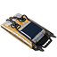
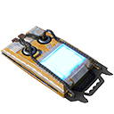
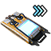
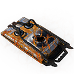
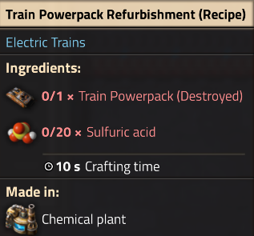
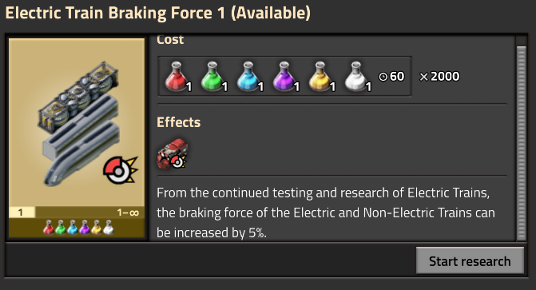

# Factorio Electric Train Mod

This mod adds electric trains to the game. It is based on the original [Space train](https://mods.factorio.com/mod/se-space-trains) mod by FragJacker.

Electric Trains was created for both my love of the vanilla game, but my obsession with train logistics. I rebranded "Space train" from the original mod along with some recipe, physical and entity tweaks, since I wanted this mod to feel more down to earth. (Literally). I also love the idea of adding a new logistical fuelling challenge to the game.

The reward for both the resource and infrastructure expense is slightly faster, and cool sounding/looking locomotives.

The original idea for a new infinite research was going to be a max speed modifier, but unfortunately the game doesn't allow for that. So I decided to go with a braking force modifier instead.

Once again I would like to thank FragJacker for creating the original mod, and for allowing me to fork it.

## Features

- Electric train research, which unlocks the electric locomotive and electric cargo and fluid wagons. These can run on your existing rail network. The electric locomotive has about a 20% increase in power to weight ratio over the vanilla locomotive and a 518Km/h max speed but uses a lot of:

- Train Powerpacks (stack-size 60-Empty 20-Charged 20-Destroyed), that are charged in a:

- Train Powerpack Charging Station, or:

- (0.1.2+) an Experimental Train Powerpack Charging Station which works much faster, but uses considerably more power, and has a much higher chance of destroying the powerpack.

- Train PowerPacks have a 1% chance of becoming destroyed when charging normally, and a 15% chance of becoming destroyed when charging in the experimental charging station.

- You can refurbish old powerpacks in a vanilla chemical plant with a new recipe.

  
  
  

- Electric trains have subtly different MiniMap icons to distinguish them from vanilla trains.

- New infinite research to increase the braking force of trains as a result of your testing and research into the new electric trains.

## Planned Features

- We have just completed the Experimental Train Powerpack Charging Station, but we are looking at adding more experimental research and recipes in the future!

## Changelog

See [CHANGELOG.md](CHANGELOG.md) for details.

## Contributing

Contributions are welcome. Please feel free to open an issue or submit a pull request. :)
